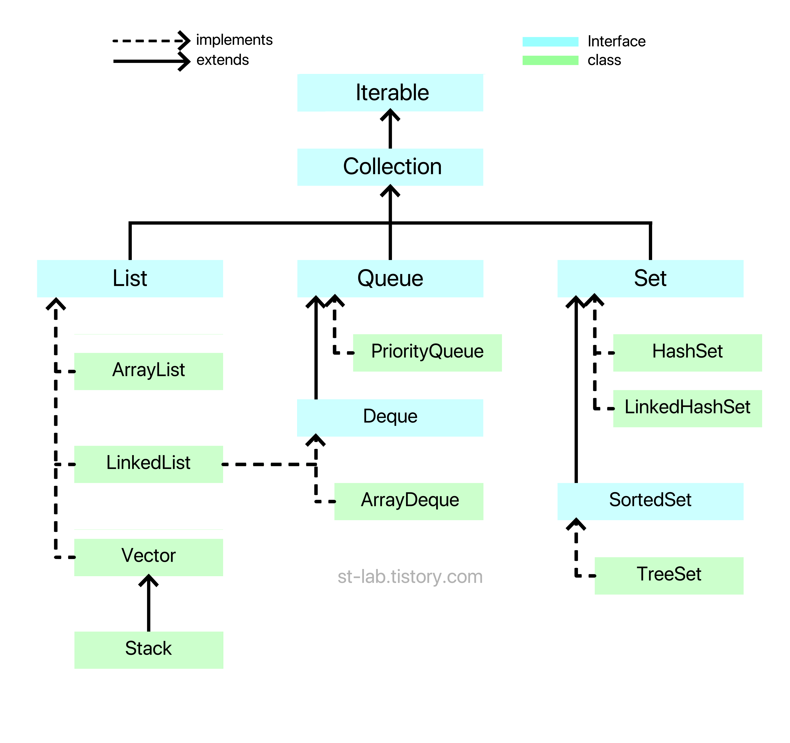

# 컬렉션 프레임워크

### 컬랙션 프레임워크(Collection Framework)란?
다수의 데이터를 쉽고 효과적으로 처리할 수 있는 표준화된 방법을 제공하는 클래스의 집합.  
_즉,_ 데이터를 저장하는 자료 구조와 데이터를 처리하는 알고리즘을 구조화하여 클래스로 구현해 놓은 것.



## 핵심 인터페이스
* List
* Queue
* Set
* (Map)

이 중에서 List와 Queue, Set 인터페이스는 모두 Collection 인터페이스를 상속받지만, 구조상의 차이로 인해 Map 인터페이스는 별도로 정의된다.  
그 이유는 컬렉션 프레임워크를 모두 알아간 후에 다뤄보겠다.

## List
주로 순서가 있는 데이터를 목록으로 이용할 수 있도록 만들어진 인터페이스.  

> 배열은 할당된 범위 만큼만 쓸 수 있다. (범위를 넘어가면 IndexOutOfBoundsException)  
> 이 단점을 보완한 것이 List이며 배열의 기능 + 동적 크기 할당이 합쳐져 있다.

List 인터페이스를 구현한 모든 List 컬렉션 클래스는 다음과 같은 특징을 가진다.
* 요소의 저장 순서 유지
* 같은 요소의 중복 저장 허용 

### List 인터페이스를 구현하는 클래스
* ArrayList
* LinkedList
* Vector (+ Vector를 상속받은 Stack)

### List Interface 메소드
|메소드|설명|
|-------|---|
|boolean add(E e)|해당 리스트(list)에 전달된 요소를 추가함. (선택적 기능)|
|void add(int index, E e)|해당 리스트의 특정 위치에 전달된 요소를 추가함. (선택적 기능)|
|void clear()|해당 리스트의 모든 요소를 제거함. (선택적 기능)|
|boolean contains(Object o)|해당 리스트가 전달된 객체를 포함하고 있는지를 확인함.|
|boolean equals(Object o)|해당 리스트와 전달된 객체가 같은지를 확인함.|
|E get(int index)|해당 리스트의 특정 위치에 존재하는 요소를 반환함.|
|boolean isEmpty()|해당 리스트가 비어있는지를 확인함.|
|Iterator<E> iterator()|해당 리스트의 반복자(iterator)를 반환함.|
|boolean remove(Object o)|해당 리스트에서 전달된 객체를 제거함. (선택적 기능)|
|boolean remove(int index)|해당 리스트의 특정 위치에 존재하는 요소를 제거함. (선택적 기능)|
|E set(int index, E e)|해당 리스트의 특정 위치에 존재하는 요소를 전달받은 객체로 대체함. (선택적 기능)|
|int size()|해당 리스트의 요소의 총 개수를 반환함.|
|Object[] toArray()|해당 리스트의 모든 요소를 Object 타입의 배열로 반환함.|
  
### ArrayList
내부적으로 Object[] 배열을 사용하면서 요소를 저장.
* 장점
  + 배열을 이용하기 때문에 인덱스를 이용해 배열 요소에 빠르게 접근할 수 있다.
* 단점
  + 배열은 크기를 변경할 수 없는 인스턴스이므로, 크기를 늘리기 위해서는 새로운 배열을 생성하고 기존의 요소들을 옮겨야 하는 복잡한 과정을 거쳐야 한다.  
  + 물론 이 과정은 자동으로 수행되지만, 요소의 추가 및 삭제 작업에 걸리는 시간이 매우 길어진다.

```java

ArrayList<Integer> arrList = new ArrayList<Integer>();

// add() 메소드를 이용한 요소의 저장
arrList.add(40);
arrList.add(20);
arrList.add(30);
arrList.add(10);

// for 문과 get() 메소드를 이용한 요소의 출력
for (int i = 0; i < arrList.size(); i++) {
    System.out.print(arrList.get(i) + " ");
}

// (개선판) for 문과 get() 메소드를 이용한 요소의 출력
for (int e : arrList) {
    System.out.print(e + " ");
}

// remove() 메소드를 이용한 요소의 제거
arrList.remove(1);

for (int e : arrList) {
    System.out.print(e + " ");
}

// Collections.sort() 메소드를 이용한 요소의 정렬
Collections.sort(arrList);

for (int e : arrList) {
    System.out.print(e + " ");
}

// set() 메소드를 이용한 요소의 변경
arrList.set(0, 20);

for (int e : arrList) {
    System.out.print(e + " ");
}

// size() 메소드를 이용한 요소의 총 개수
System.out.println("리스트의 크기 : " + arrList.size());

```
```
40 20 30 10
40 20 30 10 
40 30 10
10 30 40
20 30 40
리스트의 크기 : 3
```

### LinkedList
ArrayList 클래스가 배열을 이용하여 요소를 저장함으로써 발생하는 단점을 보완.  
데이터와 주소로 이루어진 클래스를 만들어 서로 연결하는 방식.  
데이터와 주소로 이루어진 클래스를 Node(노드)라고 하는데, 각 노드는 이전의 노드와 다음 노드를 연결하는 방식.  

* 장점
  + 해당 노드를 삭제, 삽입해야 할 경우 해당 노드의 링크를 끊거나 연결만 해주면 되기 때문에 삽입, 삭제에서는 매우 좋은 효율을 보인다.
* 단점
  + 요소를 검색해야 할 경우 처음 노드부터 찾으려는 노드가 나올 때 까지 연결된 노드들을 모두 방문해야 하므로 성능이 떨어진다.

```java

LinkedList<String> lnkList = new LinkedList<String>();

// add() 메소드를 이용한 요소의 저장
lnkList.add(40);
lnkList.add(20);
lnkList.add(30);
lnkList.add(10);

for (String e : lnkList) {
    System.out.print(e + " ");
}

// remove() 메소드를 이용한 요소의 제거
lnkList.remove(1);

for (String e : lnkList) {http://www.tcpschool.com/php/intro
    System.out.print(e + " ");
}

// set() 메소드를 이용한 요소의 변경
lnkList.set(2, 50);

for (String e : lnkList) {
    System.out.print(e + " ");
}

// size() 메소드를 이용한 요소의 총 개수
System.out.println("리스트의 크기 : " + lnkList.size());

```
```
40 20 30 10
40 30 10
40 30 50
리스트의 크기 : 3
```

보다시피 코드와 실행 결과에서 ArrayList와 LinkedList의 다른 점을 찾을 수 없다.  
ArrayList와 LinkedList의 차이는 사용 방법이 아닌, 내부적으로 요소를 저장하는 방법에 있다.

### Vector
Object[] 배열을 사용하며 요소 접근에서 빠른 성능을 보인다. (ArrayList와 거의 같다. 근데 성능은 더 안좋음.)  
자바를 배울 때 그리 자주 보이지 않는 클래스이다. 잘 사용하지도 않는다.
> 그럼 Vector 왜 있음?
>> 컬렉션 프레임워크가 도입되지 전부터 지원하던 클래스였단다. 기존 코드와의 호환성을 위해서 남아있단다.

### + Stack
Vector 클래스를 상속받아, 쌓아올리는 메모리 구조를 가지고 있다. (LIFO: Last In First Out)
> 짐을 쌓아올릴 때 가장 마지막에 쌓은 짐이 가장 위에 있을 것이다. (Push)  
> 그리고 짐을 뺄 때도 가장 위에 있는 짐부터 빼게 될 것이다. (Pop)

Stack 메소드는 Vector 메소드 중 5개를 상속받아 사용한다.
|메소드|설명|
|-------|---|
|boolean empty()|해당 스택이 비어 있으면 true를, 비어 있지 않으면 false를 반환함.|
|E peek()|해당 스택의 제일 상단에 있는(제일 마지막으로 저장된) 요소를 반환함.|
|E pop()|해당 스택의 제일 상단에 있는(제일 마지막으로 저장된) 요소를 반환하고, 해당 요소를 스택에서 제거함.|
|E push(E item)|해당 스택의 제일 상단에 전달된 요소를 삽입함.|
|int search(Object o)|해당 스택에서 전달된 객체가 존재하는 위치의 인덱스를 반환함. 이때 인덱스는 제일 상단에 있는(제일 마지막으로 저장된) 요소의 위치부터 0이 아닌 1부터 시작함.|

```java

Stack<Integer> st = new Stack<Integer>(); // 스택의 생성

// push() 메소드를 이용한 요소의 저장
st.push(4);
st.push(2);
st.push(3);
st.push(1);

// peek() 메소드를 이용한 요소의 반환
System.out.println(st.peek());

System.out.println(st);

// pop() 메소드를 이용한 요소의 반환 및 제거
System.out.println(st.pop());

System.out.println(st);

// search() 메소드를 이용한 요소의 위치 검색
System.out.println(st.search(4));
System.out.println(st.search(3));

```
```
1
[4, 2, 3, 1]
1
[4, 2, 3]
3
1
```

## Queue
주로 순서가 있는 데이터를 기반으로 FIFO( : First In First Out)를 위해 만들어진 인터페이스.
> 컨베이어 벨트로 택배들이 차곡차곡 들어온다. (Add)  
> 먼저 들어온 앞에있는 택배가 먼저 나간다. (Remove)

가장 앞쪽에 있는 위치를 __헤드(head)__ 라고 부르고, 가장 뒤에 있는 위치를 __꼬리(tail)__ 라고 부른다.  

### Deque
Collection 구조를 보면 알겠지만, Queue를 상속하고 있는 Deque(덱) 이라는 것도 있다.  
Queue는 한쪽 방향으로만(단방향) 삽입 삭제가 가능한 반면,  
Deque는 Double ended Queue라는 의미로 _양쪽에서_ 삽입삭제가 가능한 자료구조이다.  
즉, 머리에서도 접근 가능하며, 꼬리에서도 접근 가능한 양방향 큐라고 보면 된다.

### Queue/Deque 인터페이스를 구현하는 클래스
* LinkedList
* ArrayDeque
* PriorityQueue

> LinkedList가 왜 거기서 또 나와..?
>> LinkedList는 _List_ 를 구현하기도 하지만, _Queue_ 와 _Deque_ 도 구현하다.  

> 그럼 왜 LinkedList를 사용함?
>> 선형 자료구조에서 가장 대표적이고 많이 쓰이기 때문. Queue를 노드 객체로 연결해서 관리하길 원한다면 LinkedList를 사용하면 된다. (일반적인 큐를 사용하고자 하면 LinkedList로 생성하면 된다.)    
>> 물론, Object[] 배열로 관리하길 원한다면 ArrayList를 사용해도 된다. ArrayList도 마찬가지로 List, Queue, Deque 모두 쓰일 수 있다. (ArrayList로 만들어진게 ArrayDeque이다.)

> PriorityQueue는 뭐임?
>> 우선순위 큐. FIFO 전제 아래 우선순위가 높은 데이터가 먼저 나옴. 따로 정렬 방식을 지정하지 않는다면 __낮은 숫자가 높은 우선순위를 가짐.__

Queue 메소드는 Collection 메소드를 상속받아 사용한다.
|메소드|설명|
|-------|---|
|boolean add(E e)|해당 큐의 맨 뒤에 전달된 요소를 삽입함. 만약 삽입에 성공하면 true를 반환하고, 큐에 여유 공간이 없어 삽입에 실패하면 IllegalStateException을 발생시킴.|
|E element()|해당 큐의 맨 앞에 있는(제일 먼저 저장된) 요소를 반환함.|
|boolean offer(E e)|해당 큐의 맨 뒤에 전달된 요소를 삽입함.|
|E peek()|해당 큐의 맨 앞에 있는(제일 먼저 저장된) 요소를 반환함. 만약 큐가 비어있으면 null을 반환함.|
|E poll()|해당 큐의 맨 앞에 있는(제일 먼저 저장된) 요소를 반환하고, 해당 요소를 큐에서 제거함. 만약 큐가 비어있으면 null을 반환함.|
|E remove()|해당 큐의 맨 앞에 있는(제일 먼저 저장된) 요소를 제거함.|

```java

LinkedList<String> qu = new LinkedList<String>(); // 큐의 생성

// add() 메소드를 이용한 요소의 저장
qu.add(4);
qu.add(2);
qu.add(3);
qu.add(1);

// peek() 메소드를 이용한 요소의 반환
System.out.println(qu.peek());

System.out.println(qu);

// poll() 메소드를 이용한 요소의 반환 및 제거
System.out.println(qu.poll());

System.out.println(qu);

// remove() 메소드를 이용한 요소의 제거
qu.remove(1);

System.out.println(qu);


```
```
4
[4, 2, 3, 1]
4
[2, 3, 1]
[2, 3]
```

## Set
